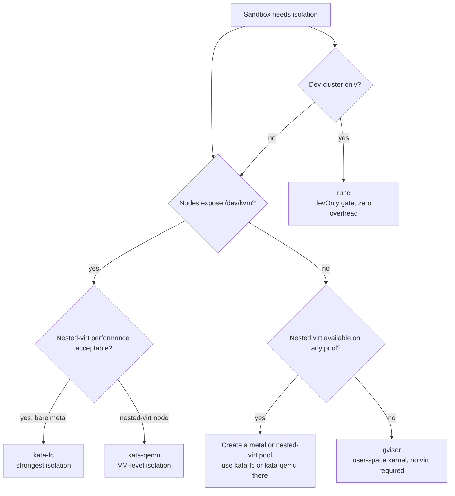

# Runtime backends

Setec dispatches each `Sandbox` to one of four runtime backends: `kata-fc`, `kata-qemu`, `gvisor`, or `runc`. This page explains why multiple backends exist, summarizes the security posture of each, and points at platform-specific playbooks.

## Why multiple runtimes

Setec's default backend, `kata-fc` (kata-containers with Firecracker), provides the strongest isolation primitive in the set: each Sandbox is a separate microVM with its own kernel, scheduled by KVM. That isolation is only available when the node can open `/dev/kvm`. On most managed-Kubernetes fleets, the node itself is a virtual machine (EC2 non-metal, GKE non-C3-metal pools, AKS standard SKUs, vSphere), and running Firecracker inside that VM requires **nested virtualization** — a capability that is either disabled or unsupported on the majority of default node types. Regulated environments sometimes forbid nested virt outright.

If Setec shipped only `kata-fc`, any customer without bare-metal or nested-virt-capable nodes would have no working path. The four-backend model preserves Gibson's "same safety" promise across the full deployment matrix: customers with bare-metal keep `kata-fc`; customers on nested-virt nodes can choose `kata-qemu` (hardware virt where available, TCG fallback where not) or `gvisor` (user-space kernel, no virt); dev clusters can opt into `runc` for the lowest-overhead path. The choice is explicit and per-`SandboxClass`; Setec does not silently downgrade isolation.

## Runtime matrix

| Backend | Isolation model | Kernel sharing | Host impact of guest escape | CVE surface | Default overhead |
|---|---|---|---|---|---|
| kata-fc | microVM (Firecracker) per Sandbox | None — each Sandbox has its own Linux kernel | Attacker must escape Firecracker VMM, then KVM, then the host kernel | Kata Containers Security Advisories (KCSA) — see upstream VMT process at github.com/kata-containers/community/blob/main/VMT/VMT.md; published advisories at github.com/kata-containers/kata-containers/security/advisories | ~128 MiB memory + ~250m CPU (microVM kernel + agent) |
| kata-qemu | microVM (QEMU) per Sandbox | None — each Sandbox has its own Linux kernel | Attacker must escape QEMU, then KVM (or TCG), then the host kernel | Same Kata VMT process as kata-fc; QEMU CVE stream adds a larger historical attack surface than Firecracker — see upstream docs | Similar to kata-fc; verify against cluster benchmarks |
| gvisor | User-space kernel (Sentry) with seccomp-bpf filter | Host kernel shared, but only a narrow syscall subset reaches it via Sentry | Attacker must escape the Sentry sandbox; host syscalls are filtered by a two-layer model (Sentry + seccomp/namespaces) — see gvisor.dev/security/ | gVisor security reporting and classification policy at gvisor.dev/security/; CVEs tracked under the Google gVisor product — see upstream docs | ~40 MiB memory (Sentry process); CPU overhead workload-dependent |
| runc | Linux namespaces + cgroups only (OCI container) | Host kernel shared directly | Kernel bug reachable from the container is a direct host compromise | runc advisories at github.com/opencontainers/runc/security/advisories (recent examples: CVE-2025-31133, CVE-2025-52565, CVE-2025-52881) | ~0 MiB additional overhead |

Notes:

- "Default overhead" values are starting points for the Helm `runtimes.<backend>.defaultOverhead` field. NFR-Performance requires per-cluster benchmarks before treating these as steady-state numbers.
- `runc` is container-only isolation. It is gated by `devOnly=true` in the chart and must not be used for multi-tenant or untrusted workloads.
- The "CVE surface" column cites the canonical upstream locations for advisory streams. Individual CVE IDs change over time; consult the linked indexes rather than relying on a snapshot.

## Decision guide

The operator is expected to configure a `fallback` chain on each `SandboxClass` so production Sandboxes degrade predictably if the preferred backend is not available on any node. See REQ-1.5 for the fallback contract.

## Pointers

Platform-specific playbooks:

- [AWS EKS](./eks.md)
- [Google GKE](./gke.md)
- [Azure AKS](./aks.md)

Related spec documents (internal):

- `.spec-workflow/specs/setec-runtime-backends/requirements.md` — Requirement 3.1, 5.3; NFR-Security
- `.spec-workflow/specs/setec-runtime-backends/design.md` — Overview, four-backend architecture

Upstream references:

- Kata Containers VMT: https://github.com/kata-containers/community/blob/main/VMT/VMT.md
- Kata Containers advisories: https://github.com/kata-containers/kata-containers/security/advisories
- gVisor security policy: https://gvisor.dev/security/
- gVisor security architecture: https://gvisor.dev/docs/architecture_guide/security/
- runc advisories: https://github.com/opencontainers/runc/security/advisories
